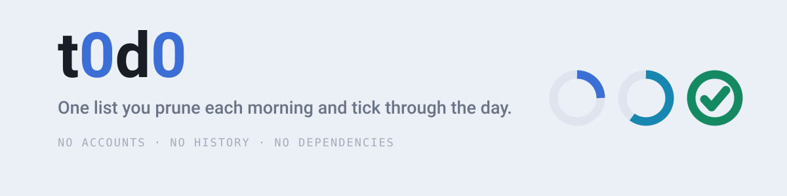
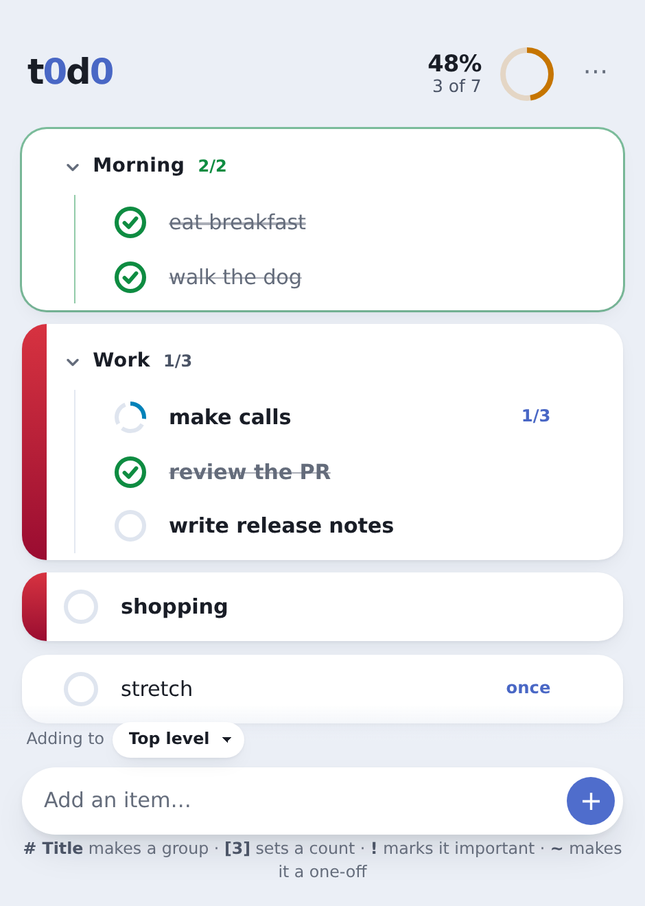

<div align="center">

<picture>
  <source media="(prefers-color-scheme: dark)" srcset=".github/banner-dark.svg">
  
</picture>

<br>

**An ephemeral day tracker.** Prune the list each morning, tick through it during the day,
clear it when you're done. No accounts, no sync, no history — it replaces a plain text
file, and losing it should cost nothing.

<br>

[](https://github.com/kfurtak1024/t0d0/actions/workflows/ci.yml)
[](https://github.com/kfurtak1024/t0d0/actions/workflows/deploy.yml)
[](./LICENSE)

[](#no-dependencies-is-a-feature)
[](#no-dependencies-is-a-feature)
[](./tsconfig.json)
[](./vite.config.ts)

### [**→ t0d0.krfu.dev**](https://t0d0.krfu.dev)

<br>

<picture>
  <source media="(prefers-color-scheme: dark)" srcset=".github/screenshot-dark.png">
  
</picture>

</div>

---

## What it does

Everything lives in your browser's local storage. Nothing is sent anywhere — after the
page loads it makes no network requests at all, and the Content Security Policy enforces
that rather than merely promising it.

- **One persistent list.** It's still there tomorrow. You edit it; nothing expires on its own.
- **Groups, one level deep.** Enough to separate _Morning_ from _Work_, not enough to become an outliner.
- **Counted items.** `make calls [3]` takes three ticks, and partial progress counts.
- **A rewarding tick.** Springy rings that sweep indigo → green as the day fills in, a wiping strike-through, and confetti when everything is done.
- **An ending.** Closing the day reports what you actually did before clearing the ticks — so an ordinary 7-of-9 day gets an ending too, not just a perfect one.
- **Offline and installable.** A real PWA; open it with the network off.
- **Light, dark, or whatever your device says.** Settings → Theme, remembered per browser.
- **Backups.** Save a `.json` copy, drop one back in. Loading previews what the file holds before replacing anything, and erasing takes two deliberate presses.

## Using it

| Type this        | To get                                 |
| ---------------- | -------------------------------------- |
| `shopping`       | a task                                 |
| `make calls [3]` | a task that takes three ticks          |
| `# Morning`      | a group, with the composer aimed at it |

| Do this                                          | To                                                    |
| ------------------------------------------------ | ----------------------------------------------------- |
| Click a ring                                     | tick, or count up one                                 |
| Shift-click a ring                               | count back down — on touch, tap the `1/3` label       |
| Click any text                                   | edit in place; `Enter` commits, `Escape` reverts      |
| <kbd>Tab</kbd> / <kbd>Shift</kbd>+<kbd>Tab</kbd> | move a focused item into the group above, or back out |
| <kbd>Space</kbd>                                 | tick the focused item                                 |
| <kbd>Ctrl</kbd>/<kbd>Cmd</kbd>+<kbd>Z</kbd>      | undo a delete, an import, or a cleared day            |
| `⋯`                                              | theme, save a copy, load one back, erase everything   |

## Quick start

```sh
npm ci
npm run dev
```

| Script              | Does                                                     |
| ------------------- | -------------------------------------------------------- |
| `npm run dev`       | dev server with hot reload                               |
| `npm run build`     | typecheck, then production build into `dist/`            |
| `npm run preview`   | serve the built output                                   |
| `npm test`          | unit and DOM tests                                       |
| `npm run test:e2e`  | Playwright — desktop Chromium, WebKit, and mobile Safari |
| `npm run lint`      | ESLint                                                   |
| `npm run icons`     | regenerate the favicon and PWA icons                     |
| **`npm run check`** | **lint + typecheck + test — the gate CI runs**           |

Node version is pinned in [`.nvmrc`](./.nvmrc).

## No dependencies is a feature

The shipped page contains **zero third-party code**. No framework, no UI library, no
animation library — 11.5 kB gzipped, all of it written here. Vite, TypeScript, Vitest,
Playwright, and ESLint are build-time only.

That isn't austerity for its own sake. This is a tool one person opens every morning, and
it should still run untouched in ten years without an upgrade treadmill. The
[CSP](./index.html) blocks every external origin, so the promise holds by construction
rather than by discipline.

The motion comes from the platform: `@starting-style` for enter and exit, one shared
spring expressed as a CSS [`linear()`](./src/styles/tokens.css) easing curve, and a
`stroke-dashoffset` transition for the arcs.

## How it's built

```
src/
├─ types.ts parse.ts progress.ts normalize.ts   pure, DOM-free, heavily tested
├─ transitions.ts                               every state change as State → State
├─ storage.ts store.ts                          persistence and one level of undo
├─ render/    list.ts ring.ts task.ts group.ts  keyed DOM patching
├─ ui/        toast sheet backup confetti edit
└─ styles/    tokens.css base.css app.css
```

Two pieces are worth knowing about:

**[`src/render/list.ts`](./src/render/list.ts)** is a keyed patch. It exists so updating a
row never destroys its DOM node — rebuilding the list wholesale would cancel in-flight
transitions and drop focus mid-edit, which on a page whose entire point is how the ticking
feels is not a small bug.

**[`src/normalize.ts`](./src/normalize.ts)** is the single gate for data arriving from
outside, whether from local storage or a pasted import. It repairs rather than trusts:
clamps counts into range, drops empty text, regenerates duplicate ids. A corrupt store
yields a working app, not a blank page.

Everything above `render/` is pure, which is why the interesting rules — parsing, the
progress formula, repair, and every state transition — are covered without a browser.

## Deploying

Pushing to `main` runs the full gate, builds, and publishes to GitHub Pages via Actions.
Nothing is committed back to the repo; `public/CNAME` carries the custom domain into every
build. Pages **Source** must be set to _GitHub Actions_ — there is no directory to point at.

## Design notes

[`CLAUDE.md`](./CLAUDE.md) records the constraints, the model invariants, and what is
deliberately out of scope — recurring items, streaks, history, and Pomodoro timers are all
"no" on purpose.

[`prototype/index.html`](./prototype/index.html) is the original single-file prototype this
was ported from. It is kept for reference and is not part of the build.

## License

MIT © [Krzysztof Furtak](https://github.com/kfurtak1024) — see [LICENSE](./LICENSE).
